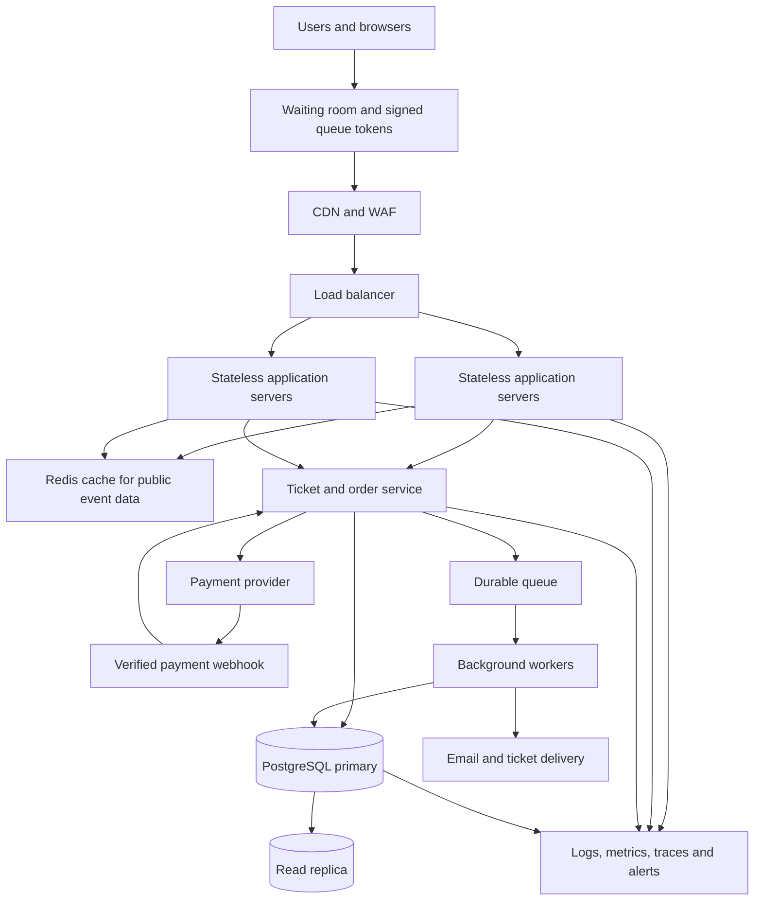

# TicketHub: Concert and Event Ticketing System Design

## 1. Requirements

### Functional requirements

1. Visitors can browse events and search by name, venue, date, and category.
2. Users can register, sign in, and view event details.
3. Users can view a venue's seats and see whether each seat is available, held, or sold.
4. An authenticated user can temporarily hold available seats for checkout.
5. Users can pay for an order and receive a confirmed booking only after successful payment verification.
6. Users can view their orders and tickets.
7. Users can cancel an order where the event's cancellation policy permits it.
8. The system sends booking confirmations and provides a way to validate ticket QR codes.

### Non-functional requirements

- **Performance:** Event pages should normally load within 300 ms at the 95th percentile, excluding unusually slow client networks. Seat availability and hold requests should normally respond within 500 ms at the 95th percentile under supported load.
- **Correctness:** A seat must never have two active confirmed bookings. Payment retries must not create duplicate orders or charges.
- **Fairness:** During a popular sale, users enter a controlled waiting room and are admitted in queue order, with protections against automated abuse. The queue issues a short-lived, signed admission token.
- **Availability:** Browsing should remain available if a payment provider is temporarily unavailable. The system must fail safely for booking operations when it cannot verify seat ownership.
- **Scalability:** The application should scale horizontally to handle a large sale without relying on a single application server.
- **Security:** Require authentication for holds and purchases, authorize every order access, validate inputs, rate-limit abuse, protect payment webhooks, and never store raw card details.
- **Durability and recovery:** Confirmed orders and payment records must persist in the database, with backups and tested recovery procedures.
- **Observability:** Monitor queue length, API latency, hold failures, payment errors, database contention, and duplicate-booking attempts.

## 2. Traffic and Capacity Estimates

The following estimates are planning assumptions, not measured production results.

### Normal day

Given:
- 2,000,000 registered users.
- 50,000 daily visitors.
- 10 page views per visitor.
- 5,000 tickets sold per day.

Page views per day:

50,000 visitors × 10 pages = 500,000 page views/day.

Average page-view rate:

500,000 ÷ 86,400 seconds ≈ 5.8 page views/second.

This is only an average. Traffic will be higher during evenings and popular events. For initial planning, assume a 10× busy-period multiplier, or about 58 page views/second. Actual API requests will be higher because one page can make several API calls.

Average ticket sales:

5,000 ÷ 86,400 ≈ 0.058 tickets/second, or about 208 tickets/hour averaged across the day.

### Popular concert sale

Given:
- 200,000 people try to buy tickets in 10 minutes.
- Only 20,000 seats are available.

Average arrival rate:

200,000 ÷ 600 seconds ≈ 333 purchase attempts/second.

Maximum seat sales needed to sell all seats evenly across the window:

20,000 ÷ 600 ≈ 33.3 seats/second.

There are 10 interested buyers per available seat. Not everyone can succeed, so the system must reject or queue excess demand without overselling.

For rough API capacity planning, assume five API requests per purchase attempt across event access, seat selection, holding, checkout, and order status. That gives:

200,000 × 5 ÷ 600 ≈ 1,667 API requests/second on average during the sale.

Plan an initial burst target of about 5,000 requests/second (roughly 3× that estimate), then load-test and adjust. Static pages and event details should be cached; seat holds and order writes must go through authoritative transactional services.

### Comparison and implications

Normal traffic averages approximately 5.8 page views/second, while the sale can produce about 1,667 API requests/second under the stated request assumption. These figures measure different things, so they are not a direct like-for-like comparison, but they demonstrate the sale's much greater backend demand.

Use a waiting room, rate limiting, horizontally scaled stateless application servers, cached read-only event data, and a transactional database for seat ownership. Never use a cache as the final authority on whether a seat can be sold.

## 3. API Design

Base path: `/api/v1`

All endpoints use HTTPS. JSON responses include consistent error objects. Authenticated endpoints require a valid session or bearer token. Mutating requests support idempotency keys where retries could otherwise create duplicate actions.

| Method and endpoint | Purpose | Important behaviour |
|---|---|---|
| `GET /events?date=&category=&q=` | Browse/search events | Supports pagination; cache public event data |
| `GET /events/{eventId}` | View event details | Returns venue, time, and sale status |
| `GET /events/{eventId}/seats` | View seats and availability | Returns seat IDs, labels, prices, and availability; data can change immediately |
| `POST /holds` | Temporarily hold seats | Requires authentication, an admission token during a controlled sale, seat IDs, and an idempotency key; returns hold ID and expiry |
| `DELETE /holds/{holdId}` | Release a hold | Only the owning user can release it |
| `POST /orders` | Create an order from a valid hold | Verifies hold ownership and expiry inside a transaction; returns pending order |
| `POST /orders/{orderId}/payment-intent` | Start payment | Creates or reuses a payment intent with the payment provider |
| `POST /payments/webhook` | Receive provider payment result | Verifies the provider signature and handles duplicate webhook deliveries safely |
| `GET /me/orders` | List the current user's orders | Returns only that user's orders |
| `GET /me/orders/{orderId}/tickets` | View purchased tickets | Requires ownership and a confirmed paid order |

### Example: hold seats

Request:

```json
{
  "eventId": "evt_123",
  "seatIds": ["seat_A10", "seat_A11"],
  "idempotencyKey": "client-generated-unique-value"
}
```

Successful response:

```json
{
  "holdId": "hold_789",
  "status": "held",
  "expiresAt": "2026-11-01T12:05:00Z"
}
```

If a seat has already been held or sold, the service returns `409 Conflict` and identifies the seats that could not be held. The client must refresh availability rather than assume the earlier seat map is still current.

### Example error response

```json
{
  "error": {
    "code": "SEAT_UNAVAILABLE",
    "message": "One or more selected seats are no longer available."
  }
}
```

Common status codes: `400` invalid input, `401` unauthenticated, `403` forbidden, `404` missing event/order, `409` seat conflict, `429` rate limit or queue restriction, and `503` temporarily unavailable service.

## 4. Data Model

Use PostgreSQL as the authoritative database because ticket purchases require transactions, foreign keys, unique constraints, and reliable concurrent updates.

### Tables and relationships

**users**
- `id` primary key
- `email` unique and not null
- `password_hash` not null
- `created_at`

**events**
- `id` primary key
- `name` not null
- `venue`
- `starts_at`
- `sales_open_at`
- `status` (draft, scheduled, on_sale, sold_out, cancelled)
- `created_at`

**seats**
- `id` primary key
- `event_id` foreign key to `events.id`
- `section`, `row_label`, `seat_number`
- `price`
- `status` (available, held, sold)
- `hold_order_id` nullable foreign key to `orders.id`
- `hold_expires_at` nullable
- `version` for optional optimistic concurrency checks
- unique constraint on `(event_id, section, row_label, seat_number)`

**orders**
- `id` primary key
- `user_id` foreign key to `users.id`
- `status` (pending, awaiting_payment, confirmed, expired, cancelled, payment_failed)
- `total_amount`
- `currency`
- `idempotency_key`
- `created_at`, `expires_at`
- unique constraint on `(user_id, idempotency_key)`

**order_items**
- `id` primary key
- `order_id` foreign key to `orders.id`
- `seat_id` foreign key to `seats.id`
- `price_at_purchase` (snapshot of the price at checkout)
- `status` (held, confirmed, released)
- unique constraint on `(order_id, seat_id)`
- a database-enforced rule or partial unique index ensures a seat cannot belong to more than one active confirmed order item

**payments**
- `id` primary key
- `order_id` foreign key to `orders.id`
- `provider_reference` unique
- `idempotency_key` unique
- `amount`, `currency`
- `status` (pending, succeeded, failed, refunded)
- `created_at`, `updated_at`

Relationships:
- One user can create many orders.
- One event has many seats.
- One order has many order items.
- Each order item refers to one seat.
- An order can have payment attempts/records, with provider references preventing duplicate payment processing.

The `seats` table contains one row for each physical seat at an event. The unique event/section/row/seat constraint prevents duplicate seat definitions. Seat state is updated transactionally; the cache is never used to make the final purchase decision.

## 5. Preventing Double-Booking

**The database, not the browser, queue, or cache, guarantees seat ownership.** Two users may see the same seat marked available in a slightly stale seat map. Only one of them can successfully claim it.

### Atomic hold operation

1. Authenticate the user and validate the event and queue admission token.
2. Begin a database transaction.
3. Lock the requested seat rows in a consistent order using `SELECT ... FOR UPDATE`, or use an atomic conditional `UPDATE`.
4. Change a seat from `available` to `held` only if it is available, or its previous hold has expired. Set the hold expiry and associate it with the new order/hold.
5. Check that every requested seat was successfully claimed. If any seat is unavailable, roll back the entire transaction so the user does not receive only part of a multi-seat request unless partial holds are explicitly supported.
6. Insert the order and order-item records and commit the transaction.

An illustrative conditional update for one seat is:

```sql
UPDATE seats
SET status = 'held',
    hold_expires_at = NOW() + INTERVAL '5 minutes'
WHERE id = :seat_id
  AND (
    status = 'available'
    OR (status = 'held' AND hold_expires_at < NOW())
  )
RETURNING id;
```

The real implementation must also associate the seat with the correct hold/order and check the returned row count. If no row is returned, the seat was not claimed. For multiple seats, all seat updates and order-item inserts occur in the same transaction.

### Payment and confirmation

- A hold expires after five minutes unless extended under a defined policy. A background worker releases expired holds, but the hold endpoint must also check expiry itself; correctness cannot depend solely on the worker running on time.
- Payment starts from a valid hold. Do not hold a database transaction open while waiting for an external payment provider.
- After a signed payment success webhook or verified provider response, a short database transaction locks the order and seats, checks the hold/order state, records the payment idempotently, marks the order and order items confirmed, and marks the seats sold.
- If payment succeeds after a hold has expired and another buyer has acquired the seat, do not confirm the conflicting order. Place it into a reconciliation/refund workflow and alert operations.
- Use idempotency keys and unique provider references so retries and duplicate webhooks cannot create duplicate orders or charges.
- Enforce the active-seat uniqueness rule with a database constraint/index as a final defence. All application instances use the same authoritative database.

**Why this works:** row locking or an atomic conditional update serializes competing claims. The first transaction changes the seat state; the second transaction rechecks the state and fails. Constraints reject invalid duplicate ownership even if an application bug slips through. The waiting room reduces contention but does not itself guarantee correctness.

## 6. Architecture and How It Survives a Big Sale



### Component responsibilities

1. **Waiting room:** During a high-demand sale, limits admission to a controlled rate and assigns signed, short-lived tokens. Queue policy should be published and monitored. It improves fairness and reduces overload, but cannot prevent double-booking by itself.
2. **CDN and WAF:** Serves static files and cached public event pages close to users. Filters common malicious traffic and abusive request patterns. Seat availability and purchase decisions are not served as authoritative cached data.
3. **Load balancer:** Distributes requests across healthy application servers and removes unhealthy instances from rotation.
4. **Stateless application servers:** Handle authentication, validation, browsing, and API requests. Multiple instances can be added during the sale. Session state is kept in a shared session/token system rather than local server memory.
5. **Redis cache:** Stores public event details and other safe-to-cache reads. Use short TTLs and invalidate or refresh data when events change. Seat holds and paid orders always require database checks.
6. **Ticket/order service and PostgreSQL primary:** Owns seat transitions, holds, orders, and payment state. Database transactions, row locks, and constraints protect correctness. Use connection pooling, suitable indexes, backups, monitoring, and tested failover.
7. **Read replica:** Offloads suitable browsing/reporting queries. Reads that determine whether a seat can be purchased must use the primary or another consistency-safe path, not a potentially stale replica.
8. **Payment provider and webhook handler:** Processes payments outside the database transaction. Webhooks are authenticated, idempotent, and reconciled with provider records.
9. **Durable queue and background workers:** Send tickets and emails, release expired holds, reconcile payment outcomes, and retry transient failures. Jobs have retry limits, backoff, idempotency, and a dead-letter path for manual review.
10. **Observability:** Collects latency, error rates, queue depth, database locks, connection pool usage, payment outcomes, and booking conflicts. Alerts help operators respond before customers experience widespread failure.

### Big-sale operating strategy

- Pre-create event seats and indexes before tickets go on sale.
- Warm the cache for event descriptions and static venue information.
- Ramp queue admission gradually; set per-user and per-token limits.
- Autoscale application servers using request rate, latency, and CPU, while setting safe maximums for database connections.
- Protect PostgreSQL from overload using connection pooling, bounded concurrency, and short transactions.
- Keep payment-provider calls outside seat-locking transactions. Process slow email and ticket delivery asynchronously.
- If the database or payment verification is unhealthy, pause new holds or fail closed rather than sell seats without confirmed ownership.
- Load-test the 5,000 requests/second planning target and higher bursts, measure database lock contention, and adjust admission rate and capacity based on results.
- Back up the database and test restoration and failover before a major event.

## 7. Trade-offs and Alternatives Considered

### Trade-off 1: PostgreSQL transactions vs. a distributed NoSQL-first design

**Chosen:** PostgreSQL for seat inventory, orders, and payments.

**Why:** Transactions, row-level locks, foreign keys, and unique constraints make the single-seat ownership rule clear and enforceable.

**Cost:** A highly contended event can create lock contention and a database bottleneck. The team must optimize queries, limit concurrent admission, and scale reads separately.

**Alternative:** A NoSQL database could offer flexible data models and horizontal partitioning, but enforcing multi-seat atomic holds and cross-record purchase correctness can be more complex. It could still be used for analytics or non-critical browsing data.

### Trade-off 2: Waiting room vs. admitting everyone immediately

**Chosen:** A controlled queue during high-demand sales.

**Why:** It protects the API and database from sudden bursts and provides a more orderly purchasing experience.

**Cost:** Users may wait and queue infrastructure adds complexity. Queue rules must be transparent and resistant to token sharing and bots.

**Alternative:** Let everyone access checkout immediately. This is simpler but risks overload, poor latency, and unfair outcomes under a sudden surge.

### Trade-off 3: Short seat holds vs. longer holds

**Chosen:** Five-minute holds, with clear expiry and controlled cleanup.

**Why:** Buyers have time to complete checkout while seats are not blocked indefinitely.

**Cost:** Some buyers may lose a seat while paying, and late payment success requires reconciliation or refunds.

**Alternative:** Longer holds improve checkout comfort but leave inventory unavailable for longer when buyers abandon checkout.

### Trade-off 4: Cache reads vs. strongly consistent seat state

**Chosen:** Cache public event details, but use transactional database state for seat holds and sales.

**Why:** This reduces read load without trusting stale cache data for an irreversible purchase.

**Cost:** Seat availability reads can be slower and place more load on the primary database.

**Alternative:** Aggressively cache the seat map. This is faster for browsing but can show stale availability, so it still cannot authorize a purchase.

## Conclusion

TicketHub can handle ordinary browsing efficiently and protect correctness during a high-demand concert sale by combining a controlled waiting room, stateless horizontally scaled application servers, cached public data, and a transactional PostgreSQL database. The key invariant is that each physical seat can have only one active owner. Atomic conditional updates, row locks, idempotent payment handling, and database constraints enforce that invariant even when many users compete for the same seat.

## 8. Atomic SQL Transaction for Seat Holds

The database must be the final authority on whether a seat can be held. Checking availability in one query and updating it in a separate query creates a race condition: two buyers may both see the seat as available. TicketHub instead uses an atomic conditional update inside a database transaction.

### PostgreSQL example

```sql
BEGIN;

UPDATE seats
SET status = 'held',
    held_by_user_id = :user_id,
    hold_expires_at = CURRENT_TIMESTAMP + INTERVAL '5 minutes'
WHERE id = :seat_id
  AND (
      status = 'available'
      OR (
          status = 'held'
          AND hold_expires_at <= CURRENT_TIMESTAMP
      )
  )
RETURNING id;

-- Application checks the number of rows returned.
-- If zero rows are returned, the seat is unavailable:
-- ROLLBACK;
-- If exactly one row is returned, the hold succeeded:
-- COMMIT;
```

### Why this prevents double-booking

PostgreSQL coordinates concurrent updates to the same row. If two buyers attempt to hold the same available seat, one update succeeds first. The other update must wait for the competing transaction to finish, then PostgreSQL evaluates the condition against the current row state. Since the seat is now held and its hold has not expired, the second update affects zero rows.

The application must commit only when the expected seat or seats have been successfully held. If any requested seat cannot be held, it rolls back the entire transaction so the buyer does not receive only part of a multi-seat booking. For multiple seats, TicketHub should lock or update them in a consistent order to reduce deadlocks.

The five-minute expiry allows another buyer to claim a seat after an abandoned hold expires. A background worker can clean up expired holds, but correctness must not depend on that worker running on time: the conditional update checks the expiry itself.

Payment processing happens separately. A successful hold is not yet a completed purchase; TicketHub confirms the order only after verified payment and uses idempotency keys to handle retries safely.
